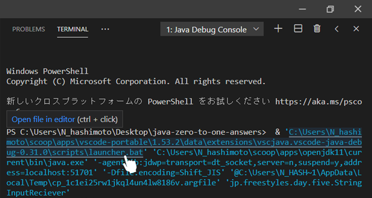

# VSCode で全角で入力された文字を標準出力する方法

VSCode で Java プログラムを扱う際に、全角で入力された文字を標準出力する方法を説明する

## launcher.bat を開く

一度、Java ファイルを実行すると、次のように launcher.bat ファイルのパスが表示される。



この launcher.bat ファイルを開きたいので、青色で表示されているパスを「Ctr + クリック」することで、launcher.bat ファイルをエディタで開く。

## launcher.bat を更新

元々の launcher.bat ファイルは次のように文字コード（chcp）が `65001` （UTF-8）となっている。

変更前: laucher.bat
```bat
@echo off

REM Change code page to UTF-8 for better compatibility.
@chcp.com 65001 > NUL 

REM Execute real command passed by args
%*
```

この chcp を　`932` に書き換えることで、文字コードを `Shift_JIS` に変更する。

変更後: laucher.bat
```bat
@echo off

REM Change code page to UTF-8 for better compatibility.
@chcp.com 932 > NUL 

REM Execute real command passed by args
%*
```
