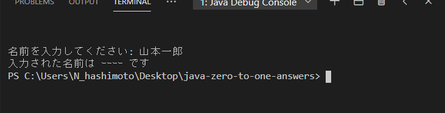
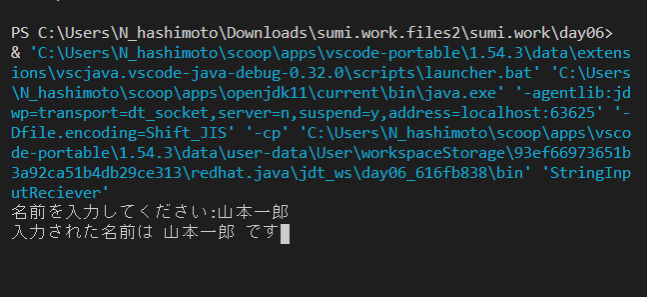

# VSCode で全角で入力された文字を標準出力する方法

VSCode で Java プログラムを扱う際に、全角で入力された文字を標準出力する方法を説明する。## 

## 全角入力文字は文字化けする

VSCode では、Java プログラムで受付けた全角文字を標準出力すると文字化けしてしまう。



> ### 文字入力を行うサンプルプログラム
> 
> ``` java
> import java.util.Scanner;
> 
> public class StringInputReciever {
> 
>     public static void main(String[] args) {
> 
>         Scanner stdin = new Scanner(System.in, "Shift_JIS");
> 
>         System.out.print("名前を入力してください: ");
>         String name = stdin.nextLine();
> 
>         System.out.format("入力された名前は %s です", name);
>         stdin.close();
>     }
> }
> ```

文字化けしてしまう理由は、VSCode が扱う文字コードが UTF-8 を想定しているのに対し、Java では、全角を Shift-JIS で扱うためだ。

次の手順で、VSCode で全角を Shift-JIS で扱えるようにする。

## launcher.bat を開く

一度、Java ファイルを実行すると、次のように launcher.bat ファイルのパスが表示される。


この launcher.bat ファイルを開きたいので、青色で表示されているパスを「Ctr + クリック」することで、launcher.bat ファイルをエディタで開く。

## launcher.bat を更新

元々の launcher.bat ファイルは次のように文字コード（chcp）が `65001` （UTF-8）となっている。

変更前: laucher.bat
```bat
@echo off

REM Change code page to UTF-8 for better compatibility.
@chcp.com 65001 > NUL 

REM Execute real command passed by args
%*
```

この chcp を　`932` に書き換えることで、文字コードを `Shift_JIS` に変更する。

変更後: laucher.bat
```bat
@echo off

REM Change code page to UTF-8 for better compatibility.
@chcp.com 932 > NUL 

REM Execute real command passed by args
%*
```

## launch.json の作成（上記の launcher.bat の更新で改善しないときのみ、以降を実施してください）

次にプロジェクト直下に `.vscode` ディレクトリを作成する。さらにその中に `launch.json` ファイルを作成する。

その launch.json ファイルに記載する encoding 設定は Shift-JIS にする。

.vscode/launch.json
```json
{
  "version": "0.2.0",
  "configurations": [
    {
      "type": "java",
      "name": "Debug (Launch) - Current File",
      "request": "launch",
      "mainClass": "${file}",
      "encoding": "Shift_JIS"
    }
  ]
}
```

これで、Run / Debugg 時に、入力された全角文字を文字化けせずに表示させることができる。


